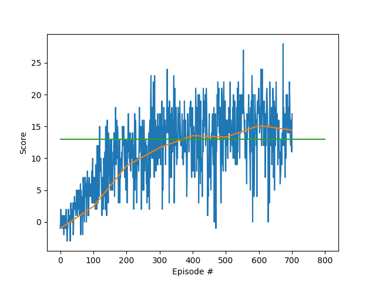

## Udacity Deep Reinforcement Learning Nanodegree
# Navigation Project Report

### Learning Algorithm

A Deep Q-Network has been implemented to solve the project according to [the paper on deep q network]. The following is 
a short overview of Deep Q-Networks and its building blocks. For a more detailed description please refer to the 
orignial papers []

#### Short overview of Deep Q-Networks

In reinforcement learning, an **Agent** interacts with an **environment** by taking **actions**. Every time agent takes 
a new action, its **state** (or state observation) is updated and a (possibly 0) **reward** is collected.
 
Actions are selected by an agent depending on its state according to a policy. 
**Q-Learning** is a reinforcement learning algorithm according to which an **optimal policy** is searched by iteratively 
interacting with an environment and updating an **action value function** (Q-function). 

The agent decides its actions depending on its state (or state observation) by applying a **policy**. The pourpose of 
reinforcement learning is of learning an optimal policy, i.e. a plolicy which maximizes the 
**expected cumulative reward** collected by the agent.

The **action value function**, associated to a given policy **\pi**, represents the **expected _discounted_ cumulative 
reward** which will be collected by starting from each given state **S**, and taking each possible action **A**, then 
continuing to interact with the environment by applaying policy **\pi** until the end of an episode (or to the end of time
in a non-episodic environment). The action value function is also called **Q-function**

**Q-learning** is a reinforcement learning algorithm according to which an agent updates its representation of the 
Q-function after every action. 

An agent in state **S_{n}** will take action **A** selected according to a policy of choice. The environment will return
reward **R** and move the agent to state **S_{n+1}**. 

According to **Q-learning**, as a result of this action and state transition, the agent will be able to formulate a new 
estimation for the action value (Q-function value) of state S_{n} and action A.  
This new estimation is the sum 2 elements: 
- the current collected reward **R**
- the future estimated reward **G** which can be collected using an optimal policy to interact with the environment 

The future cumulative reward **G** is estimated form the current estimated Q-function as the highest action value among 
the set of possible actions at state **S_{n+1}**

The Q-learning algorithm gradually updates the extimated action values for states and actions **Q{S_{n}, A}** with this 
new immediate reward **R** and the estimation of the future cumulative rewards **G**.

In the case of **finite discrete state and action spaces**, the Q-function in Q-Learning can be easily represented with a 
table associating to each State-Action pair an estimated cumulative reward. 

In the case of a **continuous state space**, (noninear) **function approximation** can be used to represent the 
Q-function and to associate an expected cumulative reward to each possible state in the continuous state space and to each possible action.
A **Q-Network** implements this function approximation by means of a **(Deep) Neural Network**.

### Implementation

#### Preliminary notes 

The main pourpose of this project is to understand get hands-on experience with the pyTorch library and with Deep 
Q-Networks and its variants. To get the most out of this assignment, I thought it better to start developing my 
DQNetwork from scratch, and to use the available DQN exercise solution only to identify possible problems at an avanced 
stage of the project.

For this reason, my implementation may deviate form the implementation proposed in the DQN solution and some of my 
implementations choices may be less effective or less intuitive than the solution design.

#### Project structure

 - **solution.py** loads and uses the trained DQN agent solving the BananaCollection environment.
    The agent had been trained for less than 700 episodes using test_q_agent.py. 
 - **test_q_agent.py** is the main file used during development the QAgent class implemented in 
    q_agent.py and the file used for training the selected DQN agent.
 - **discrete_action_env.py**, **discrete_action_gym_env.py** and **banana_env.py**: wrappers to the gym and banana collection 
    environments, they have been developed so that the DQNet agent can be run both gym and BananaCollection environments 
    with the same code. 
    The interface closely matches the gym environment interface and is defined in discrete_action_env.py, while 
    discrete_action_gym_env.py and banana_env.py are 2 implementations.
    A related simple print based test file is provided.
 - **q_agent.py**: QAgent class implementing the Deep Q-Network algorithm. Uses pytorch_base_network.py for its neural 
    network and experience_replayer.py for its experience buffer. 
    The QAgent can be configured to use the original algorithm in [] or the double QNetwork algorithm in []. 
    The QAgent also exposes a method to save its internal state and configuration to file.
 - **pytorch_base_network.py**: PytorchBaseNetwork neural network class used by  QAgent. The hidden linear 
    configuration can be specified as a list or tuple of integers as an input parameter, and dropout can be optionally
    activated. The class provides a method for saving its weights and configuration to file, and its constructor can 
    load configuration and trained weights from a saved file. A related test file using unittest module is also 
    provided.
 - **experience_replayer.py**: ExperienceReplayer class used as experience buffer by QAgent. Experience objects
    or any other object can be stored in a fixed element size memory. The oldest entries are removed where maximum capacity
    is reached, and entries can be randomly sampled from memory. Optionally, a priority value can be associated to 
    each entry. In this case experiences will be extracted with a probability which is epsilon-proportional to their 
    priority. A simple test file is also provided.
 - **param_optim.py** is a random parameter optimization script used to tests several parameter configurations.

#### Modification: Delayer network

Following the description of [], a local network is trained and used for interacting with the environment, while a 
target network is used as a reference in training, for cumputing the action values used for updating the 
action value function modelled by the local network. The target network is not directly trained, but it is instead 
updated with the weights of the local networks at regular intervals.
The target and the local network used by the agents are implemented by the PytorchBaseNetwork class in 
pytorch_base_network.py. The sequence of linear hidden layers used by the network can be specified in a list, and the 
network supports dropout. The PytorchBaseNetwork class also provides a method for saving its structure and weights to a 
file.

As an implementation choice, the proposed solution uses a soft update strategy instead of periodically copying all
weights of the local network to the target network. 
While this strategy seems reasonable and effective, it must be observed with this approach the target network are not 
only delayed but also temporally smoothed with respect to the local network weights: these smothed weights have never 
been used  by the local network and could in principle not be effective.

The approach suggested in [], of simply periodically replacing weights, also rise some perplexities. If a target
network with different weights is indeed needed to [**####**], then we might prefer this condition never to happen, 
while instead we will have identical local and target networks at regular intervals. This problem is indeed addressed by 
soft update of target network weights.

In order to have a target network which is always distinct from the local network, while still making sure that the 
weights of the target network are indeed past weights of the local network, an additional delayer 
network has been implemented. This network act as a distancing buffer between the local network and the target network.
The delayer network can be enabled via a parameter in the QAgent constructor.
I do not claim this modification to provide any significant improvement in performance, I have mainly implemented it as 
an exercise.

### Parameter tuning

A 100-tests random optimization has been run to try to better understand the impact of the different parameters on the 
network performance. The list of parameters and the 10 best results can be seen in table:
 
|file_name|best_score|pass_epoch|layers    |mem_size|update_every|learn_every|learn_rate|eps_decay|double_qnet|delayer|
|---------|----------|----------|----------|-----   |----------- |-----------|------   |-----    |-----      |-------|
|test_7.p |   15.96  |       500|[64,64]   |20000   |2           |16         |0.0005   |0.99     |False      |True   |                                            
|test_64.p|   15.14  |       400|[128,64]  |20000   |2           | 4         |0.0005   |0.99     |True       |True   |                                            
|test_53.p|   14.86  |       700|[64,64]   |5000    |2           | 8         |0.001    |0.995    |False      |True   |                                             
|test_34.p|   14.82  |       400|[32,32,32]|20000   |5           | 4         |0.001    |0.99     |True       |True   |                                          
|test_28.p|   14.82  |       600|[128,64]  |20000   |1           | 4         |0.0002   |0.99     |True       |False  |                                            
|test_72.p|   14.68  |       400|[64,64]   |20000   |5           | 4         |0.0005   |0.99     |False      |True   |                                            
|test_8.p |   14.53  |       500|[64,64]   |20000   |1           | 4         |0.0002   |0.99     |True       |False  |                                              
|test_58.p|   14.38  |       500|[32,32]   |5000    |2           | 4         |0.001    |0.99     |True       |True   |                                                
|test_94.p|   14.33  |       600|[32,32,32]|20000   |5           | 2         |0.0002   |0.995    |False      |False  |                                       
|test_41.p|   14.3   |       400|[32,32,32]|20000   |5           |16         |0.001    |0.99     |False      |True   |        

As a exercise, I will try to drive some conclusions from these results. A far larger test set would be needed to drive 
reliable conclusions on the impact of parameters of performance.                                                                                         
 - Result in the table are sorted by __best_score__: max average score observed over 100 epochs.
 - __pass_epoch__ column indicates the number of epochs taken by the algorithm to solve the environment. The environment 
is solved if the average cumulative reward in the last 100 episodes is higher than 13. Passing is checked at 100
epochs intervals, and the epoch number reported in table corresponding to the end of the averaged period 
(the score may have increased during the 100 episodes). 
- Networks with 2 and 3 hidden __layers__ have been tested. The most complex configuration [256, 128] was never selected 
 among the 10 highest scoring networks, possibly this hidden layer size would lead to overfitting.
- Best results seems to be obtained with larger memory size for experience replay. __mem_size__ values of 200 and 1000 were 
also tested but scored poorly. This confirms that experience replay is a fundamental building block for dqnet
- __update_every__ sets the interval in epochs between updates of the target network. weights are copied from the local   
 network or from the delayer network when __delayer__ is activated. The value of 10 was also tested but is not among the 
 top 10
- __learn_every__ sets the interval in actions between subsequent training call. The batch_size for training is fixed 
to 64. Although the value of 4 is prevalent, value of 1 was also tested but is not among the top 10
- __learn_rate__ takes all the values in its range. The local network weight update speed depends mainly on __learn_every__
(how often the network learns) and __learn_rate__ (how much its weights are updated as a result of learning. 
As expected, high __learn_every__ values [8,16] score high with medium-high __learn_rate__ [0.0005 0.001] while the 
lowest learning rate scores in the top ten only with small learning intervals. (these combination correspond to similar 
weigth update speeds) 
-__eps_decay__ defines how quickly the initally random policy of the actor changes to a greedy policy. When an environment 
 has been toroughly explored and no further learning is required, low values of epsilon should be used to maximize 
 the cumulative reward. On the other hand, a higher value of epsilon is needed during exploration and leaarning.
 The best scoring configurations solve the environment in less than 400 episodes, this matches epsilon reaching its 
 nominal value of 0.01 in 450 episodes with __eps_decay__ 0.99. Higher __eps_decay__ values would have the environment 
 learn for too long, collecting wrose reward values, while lower __eps_decay__ values would break exploration too early
 and prevent from finding an optimal policy.
- The performance of the network seems independent form the use of the __double_qnet__ algorithm. The algorithm does not 
 guarantee a performance improvement in all environments, as reported in the paper, so this may be possible.
- The use of a __delayer__ network seems to give a general positive contribution to overall performance. Far more data
would be needed to confirm this.  

### Results

As my final network configuration, I will select the newrork corresponding configuration of test_64 in the oprimzation
set. This network solved the BananaCollection environment in 400 episodes and reached scores beyond 15 in 600 episodes.
A plot of the reward cumulated during training is shown below.

[Here](https://youtu.be/L3VQbwDsEB4) is a video of my trained agent in action 

<iframe width="500" height="500" src="https://www.youtube.com/embed/L3VQbwDsEB4" frameborder="0" allow="accelerometer; autoplay; encrypted-media; gyroscope; picture-in-picture" allowfullscreen></iframe>

The 5 best scoring agents can be seen in action using solution.py. The top_configs folders includes the related weights, 
configuration and training scores.

### Future Work

The project has developed with the idea of being able to extend it in the future.
 - The ExperienceReplayer class supports priority values and priority sampling, enabling to implement prioritized 
 experience replay in the future
 - The PytorchBaseNetwork class supports dropout, linear layers and a stub for the addition of convolutional layers.
 - The DiscreteActionEnv interface class eases the development of environment wrappers, so that the new envorimnents 
  can be easily tested.
  
